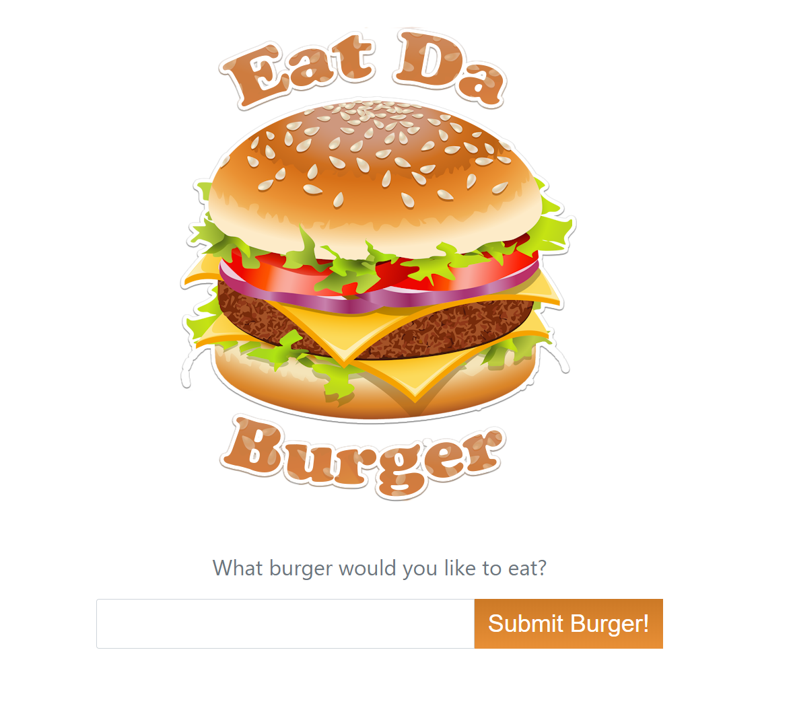

# EAT DA BURGER

### Eat-Da-Burger! is a restaurant app that lets users input the names of burgers they'd like to eat.

* Whenever a user submits a burger's name, the app will display the burger in the waiting to be devoured area.

* Each burger in the waiting area also has a `Devour it!` button. When the user clicks it, the burger will move to the eaten area.

## GitHub Repo: https://github.com/lponder82/EatDaBurger.git

## Screenshot

## Languages/Libraries used:

* Javascript
* Node.js
* Express
* Handlebars

## Also used:
* mySQL
* ORM
